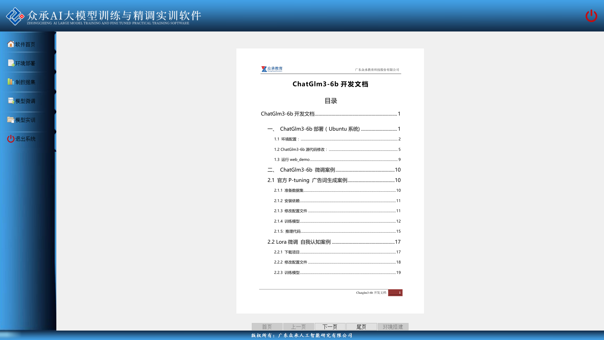
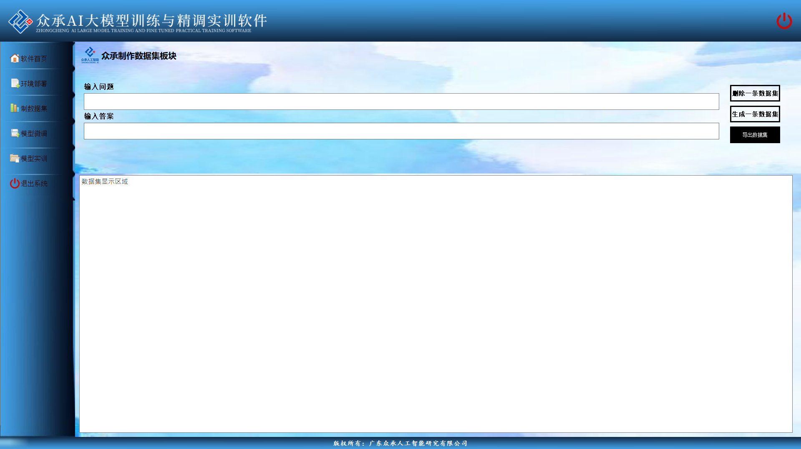
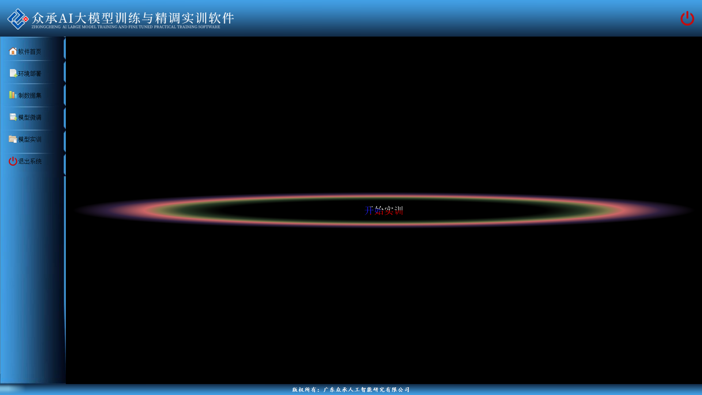
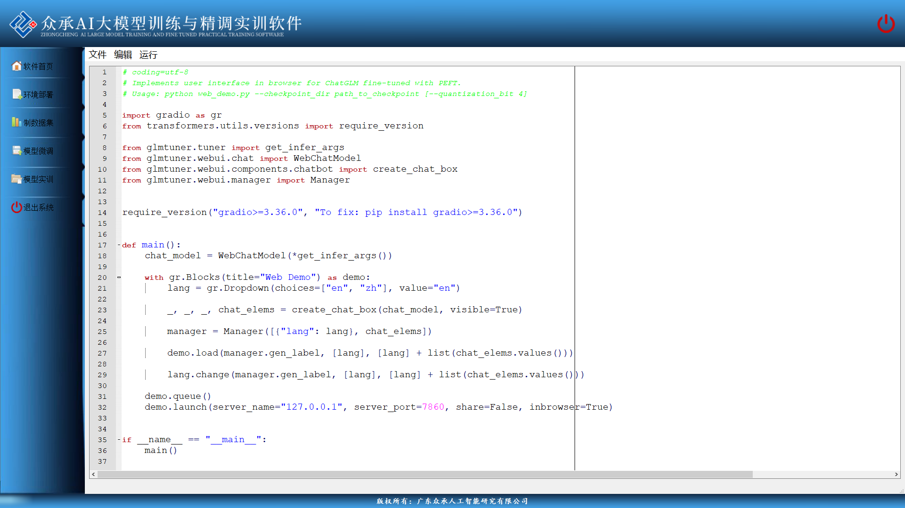

# 项目名称
📃 **众承AI大模型实训与精调软件**

---

## 目录

* [介绍](README.md#介绍)
* [功能特点](README.md#功能特点)
* [快速上手](README.md#快速开始)
* [软件图示](README.md#软件图示)
* [关于打包](README.md#关于打包)

## 介绍
😘此项目为pyqt开发结合LLM微调而成的一款软件，主体内容分为环境部署，制作数据集，模型微调，模型实训四个部分，此为V1版本代码，软件实训逻辑基本打通，无明显bug,UI界面可进一步美化,代码有很多参考价值。

## 功能特点
💡 将大语言模型的部署微调训练结合为一体，教学与应用相结合

## 快速开始(仅为框架环境)

* 可选： 
    * conda create -n LLMapp python=3.10
    * conda activate LLMapp
    
🚩pip install -r requirements.txt 

## 技术栈

👀 python,pyqt,peft,transformers,torch

## 项目简介

目录结构部分:

    modules/* 
        包含各个模块的内容
    基本组成 
        main.py程序代码文件
        *moudu_name*.ui
        *moudu_name*.qrc

## 许可证

😀 Apache License Version 2.0

## 参考资料

提供项目开发过程中参考的资料和资源。

[😘 ChatGLM-Efficient-Tuning](https://github.com/hiyouga/ChatGLM-Efficient-Tuning)

[😘 CSDN博客平台](https://www.csdn.net/)

## 软件图示
**软件首页**

**环境搭建**

**制数据集**

**模型微调**

**模型实训**

## 关于打包
external_files/

    删除以下目录
        app_overview/*
        code/*
打包示例：
    
    pyinstaller -D -w -i D:\rkwork\app\app_env\external_files\ico\logo.ico  -n gzzca_LLMapp rkmain.py
* 完成后将external_files 下的所有内容移至生成的 dist\gzzca_LLMapp 目录下
* modules 文件夹 下的所有内容移至生成的 dist\gzzca_LLMapp\_internal 目录下

        

